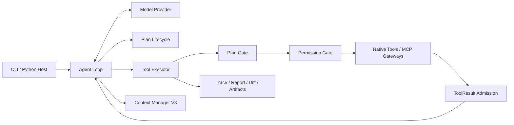
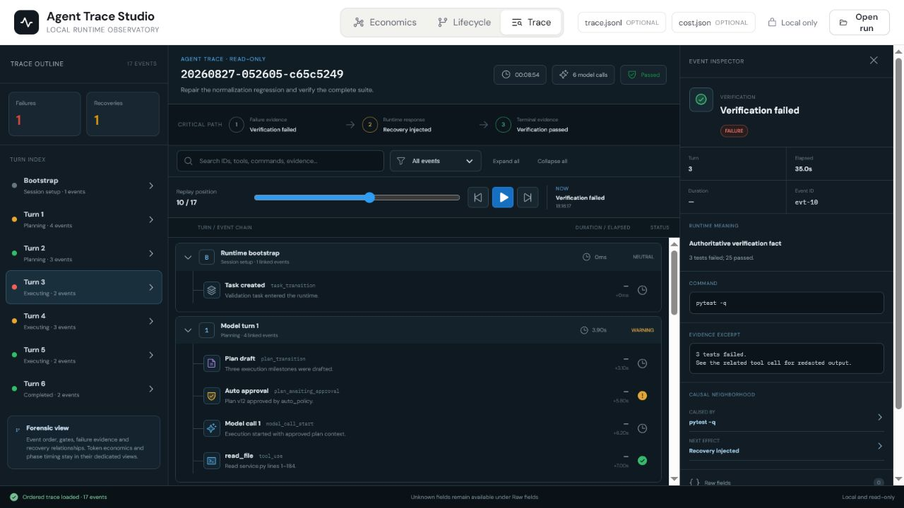

# Local Coding Agent Harness

[English](README.md) | [中文](README.zh-CN.md)

An auditable local runtime for coding agents working on real repositories. The
model chooses how to investigate and solve a task; the runtime enforces the
execution, permission, plan, verification, protocol, and context invariants
that make the work controlled and reproducible.

> **Runtime enforces invariants. Model chooses strategy.**

## Highlights

- **Controlled repository operations** — snapshot-bound reads, exact atomic
  edits, path validation, deterministic tool results, and explicit mutation
  tracking.
- **Plan-aware execution** — Direct, Auto, and Required Plan workflows with
  versioned plans, explicit approval state, capability projection, and a
  pre-permission Plan Gate.
- **Layered security** — permission modes, reusable scoped rules, command-risk
  classification, protected-path checks, non-interactive deny policy, and SRT
  sandboxing for Bash.
- **Context Manager V3** — bounded first-visible ToolResult admission,
  append-only context epochs, hybrid checkpoints, and deterministic recovery
  for source, artifacts, and compacted history.
- **MCP V2 client** — immutable startup catalog and two stable provider-facing
  gateways for tool search and invocation, keeping remote schemas out of the
  base tool array.
- **Evidence-first completion** — structured verification state, bounded repair
  recovery, changed-file tracking, and independent run artifacts.
- **Local observability** — JSONL traces, readable timelines, reports, diffs,
  token economics, and a browser-only three-view Trace Studio.
- **Deterministic evaluation** — six isolated Agent cases scored by external
  test oracles, repository invariants, and structured Plan state.

## Architecture



The runtime is composition-oriented: model orchestration, tool semantics,
authorization, context retention, and observability remain separate concerns.
The tool path is deliberately ordered so lifecycle and security checks run
before side effects:

```text
lookup -> capability resolution -> Plan Gate -> validation
       -> Permission Gate -> tool execution -> post-tool hooks
```

See [Architecture](docs/architecture.md) for the package-level dependency map.

## Core runtime

### Repository tools

The model works through explicit tools rather than unrestricted host access:

| Area | Tools | Runtime contract |
| --- | --- | --- |
| Discovery | `list_dir`, `grep`, `read_file` | Bounded output, source ranges, SHA-aware observations |
| Mutation | `edit_file`, `write_file`, `delete_file` | Exact validation, atomic edits, protected-path checks |
| Execution | `bash` | Purpose/scope metadata, risk classification, timeout, optional sandbox |
| Evidence | `view_diff`, `read_artifact`, `history_*` | Recoverable run evidence without hidden context mutation |
| Planning | `select_execution_mode`, `update_plan`, `resolve_plan_response` | State-dependent schemas and checked transitions |
| MCP | `mcp_tool_search`, `mcp_tool_call` | Stable provider surface backed by an immutable catalog |

Large tool results are shaped before their first model visibility. Source
observations retain path, SHA, and exact line ranges; large non-source output is
stored as an artifact and represented by a recoverable stub.

### Plan lifecycle

Plan policy and approval policy are independent:

| Plan policy | Behavior |
| --- | --- |
| `off` | Normal direct execution |
| `auto` | Read-only inspection followed by a structured Direct-or-Plan choice |
| `required` | Read-only planning before authorized execution |

Submitted plans are versioned. Manual approval pauses the same task at
`awaiting_approval`; automatic approval records the approved version and
`approval_source="auto_policy"`. During planning, mutation capabilities are
hidden and the Plan Gate rejects side effects before permission evaluation.
During Direct or approved execution, the existing Permission Gate remains
authoritative.

### Permission and sandboxing

Permission modes are intentionally simple:

- `read_only` — repository discovery is allowed; writes remain gated.
- `accept_edits` — structured edits and safe commands are accepted; risky
  operations remain gated.
- `manual_approval` — edits and command execution require approval.

For unattended hosts, `permission_prompt_policy="deny"` converts unresolved
permission questions into explicit denials instead of reading stdin. Existing
allow rules can pre-authorize known scopes, while hard security denials remain
authoritative.

Install the Sandbox Runtime to isolate Bash commands:

```bash
npm install -g @anthropic-ai/sandbox-runtime
agent --sandbox --sandbox-fail-if-unavailable
```

### Context Manager V3

Context capacity and recovery are runtime responsibilities. CMV3 provides:

- a 12K aggregate admission bound for each new ToolResult batch;
- append-only provider-visible history within a context generation;
- pressure-triggered Full Rebase with authoritative runtime state, a structured
  semantic handoff, and complete recent API rounds;
- atomic generation changes and protocol-valid tool-call/result grouping;
- append-only recovery from source coordinates, artifacts, and History windows.

The detailed invariant contract is maintained in [Context Manager V3
Specification](docs/spec.md).

### MCP V2 client

MCP is activated only from an explicit host configuration:

```bash
agent run "Use the configured service to inspect the target" \
  --mcp-config /absolute/path/to/mcp.json \
  --permission accept_edits
```

Example configuration:

```json
{
  "mcpServers": {
    "local": {
      "type": "stdio",
      "command": "python",
      "args": ["/absolute/path/to/server.py"]
    },
    "remote": {
      "type": "http",
      "url": "http://127.0.0.1:8765/mcp"
    }
  }
}
```

After the Agent context exists, the runtime connects, discovers tools once,
validates identities and schemas, and freezes a deterministic catalog. The
provider sees only two bounded gateways:

- `mcp_tool_search` searches catalog metadata locally.
- `mcp_tool_call` invokes one canonical remote tool through the normal Plan,
  Permission, hook, admission, and context pipeline.

This keeps the base provider tool surface stable as the remote catalog grows.
See [MCP Client V2 Specification](docs/mcp-client-spec.md) for the full contract.

## Quick start

### Requirements

- Python 3.11+
- An Anthropic or Anthropic-compatible Messages API endpoint

### Install

```bash
python -m venv .venv

# Linux / macOS
source .venv/bin/activate

# Windows PowerShell
.venv\Scripts\Activate.ps1

pip install -e ".[dev]"
```

Create `.env` from `.env.example` and configure the provider:

```bash
ANTHROPIC_API_KEY=
MODEL_ID=
MODEL_CONTEXT_WINDOW_TOKENS=
ANTHROPIC_BASE_URL=
```

`ANTHROPIC_BASE_URL` may point to an Anthropic-compatible endpoint. The runtime
uses the Anthropic Messages shape for system prompts, messages, tools,
`tool_use`, and `tool_result` blocks.

### Run

Run commands from the repository you want the Agent to operate on; that current
directory becomes `WORKDIR`.

```bash
# Interactive session
agent --permission accept_edits

# One-shot task
agent run "Fix the failing tests and verify the result" \
  --permission accept_edits

# Required Plan with automatic plan approval
agent run "Refactor the parser and run the full test suite" \
  --plan-mode required \
  --plan-approval auto \
  --permission accept_edits

# Inspect an existing run
agent report <run_id>
agent replay <run_id>
```

`lcah` is an alias for `agent`. Without installed console scripts, use
`python -m cli.app`.

## Run evidence

Every run writes an auditable bundle under:

```text
<WORKDIR>/.agent/runs/<run_id>/
```

| Artifact | Purpose |
| --- | --- |
| `trace.jsonl` | Machine-readable lifecycle, model, permission, tool, context, and verification events |
| `readable_trace.md` | Human-readable ordered trace |
| `report.md` | Task outcome, changed files, verification, sandbox, and token summary |
| `diff.patch` | Final repository diff captured by the runtime |
| `cost.json` | Per-call provider usage, cache fields, prefix fingerprints, and totals |
| `plan.json` | Versioned plan and approval audit snapshot when Plan mode is active |
| `artifacts/` | Recoverable large ToolResult payloads |

## Agent Trace Studio

`trace-viewer/` is a standalone browser application. It parses local artifacts
in the browser and does not import or modify the production runtime.

```bash
cd trace-viewer
npm install
npm run dev
```

Open a run's `trace.jsonl` and optional `cost.json` to inspect three
complementary views:

- **Economics** — per-turn input, cache reuse, uncached input, output, context
  pressure, and source-read efficiency.
- **Lifecycle** — model, plan, permission, tool, verification, and context events
  on one causal timeline.
- **Trace** — ordered event details, failure evidence, recovery links, timing,
  replay, and forward-compatible raw fields.



## Agent evaluation benchmark

The standalone `benchmarks/` package evaluates the Agent through the public
Python API in isolated temporary workspaces. Correctness comes from external
pytest runs, immutable-file checks, allowed-change boundaries, and structured
Plan invariants—not from the model's final prose.

The six deterministic cases cover:

- direct bug fixing and validation-only mutation discipline;
- Required Plan execution with automatic approval;
- cross-module diagnosis and regression-preserving repair;
- recovery after authoritative verification exposes an incomplete fix.

Run the suite sequentially:

```bash
python -m benchmarks.runner
```

Results are written to:

```text
benchmarks/results/resume.json
benchmarks/results/resume.md
```

The report separates task correctness, runtime success, end-to-end pass, and
runtime/oracle agreement. Model calls, input/output tokens, cache reads, tool
failures, and repair attempts remain observational efficiency metrics.

## Development

```bash
pytest
ruff check .
ruff format --check .
```

Trace Studio checks:

```bash
cd trace-viewer
npm test
npm run build
```

## Repository map

| Path | Responsibility |
| --- | --- |
| `src/agent/` | Model loop, prompts, message conversion, and provider client |
| `src/runtime/` | Session composition, execution policy, context, security, recovery, and observability |
| `src/tools/` | Native tools and MCP gateway adapters |
| `src/cli/` | Interactive and one-shot command-line entry points |
| `tests/` | Unit and integration coverage for runtime contracts |
| `benchmarks/` | Isolated end-to-end Agent evaluation |
| `trace-viewer/` | Local three-view trace analysis application |
| `docs/` | Architecture and frozen implementation specifications |
