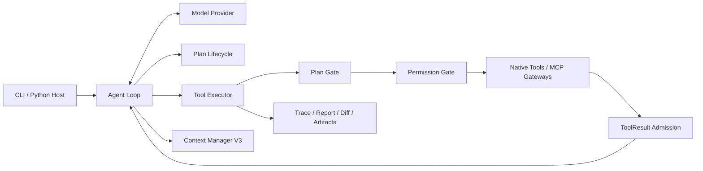

# Local Coding Agent Harness

[English](README.md) | [中文](README.zh-CN.md)

一个面向真实代码仓库、可审计的本地 Coding Agent Runtime。模型自主选择调查和解决策略；Runtime 负责落实执行、权限、计划、验证、协议与上下文不变量，使 Agent 的行为可控、可恢复、可复现。

> **Runtime enforces invariants. Model chooses strategy.**

## 项目亮点

- **受控的仓库操作**：文件读取绑定快照，编辑采用精确原子替换，并提供路径校验、确定性 ToolResult 与变更追踪。
- **Plan-aware 执行**：支持 Direct、Auto 和 Required Plan，具备版本化计划、明确审批状态、能力投影和前置 Plan Gate。
- **分层安全边界**：提供权限模式、可复用 Scope Rule、命令风险分类、受保护路径检查、非交互拒绝策略，以及 Bash 的 SRT Sandbox。
- **Context Manager V3**：包含首次可见 ToolResult 的有界准入、append-only Context Epoch、混合检查点，以及 Source、Artifact、History 的确定性恢复。
- **MCP V2 Client**：通过不可变启动 Catalog 和两个稳定 Gateway 完成工具搜索与调用，远程 Schema 不进入 Provider 基础工具数组。
- **以证据为准的完成语义**：结构化验证状态、有界修复恢复、变更文件追踪与独立运行产物。
- **本地可观测性**：提供 JSONL Trace、可读时间线、报告、Diff、Token Economics，以及纯浏览器三视图 Trace Studio。
- **确定性评估**：六个隔离 Agent 案例由外部测试 Oracle、仓库不变量和结构化 Plan 状态共同判定。

## 系统架构



Runtime 采用组合式设计，将模型编排、工具语义、授权、上下文保留和可观测性拆分为独立职责。工具调用按照固定顺序经过生命周期与安全检查，然后才允许产生副作用：

```text
lookup -> capability resolution -> Plan Gate -> validation
       -> Permission Gate -> tool execution -> post-tool hooks
```

包依赖方向与主要执行链路见[架构文档](docs/architecture.md)。

## Runtime 核心能力

### 仓库工具

模型通过显式工具操作仓库，而不是直接获得无限制的宿主访问权限：

| 领域 | 工具 | Runtime Contract |
| --- | --- | --- |
| 调查 | `list_dir`、`grep`、`read_file` | 有界输出、源码范围与 SHA-aware Observation |
| 修改 | `edit_file`、`write_file`、`delete_file` | 精确校验、原子编辑与受保护路径检查 |
| 执行 | `bash` | purpose/scope 元数据、风险分类、超时和可选 Sandbox |
| 证据 | `view_diff`、`read_artifact`、`history_*` | 可恢复的运行证据，不隐式修改历史上下文 |
| 计划 | `select_execution_mode`、`update_plan`、`resolve_plan_response` | 状态相关 Schema 与受检生命周期转换 |
| MCP | `mcp_tool_search`、`mcp_tool_call` | 不可变 Catalog 支撑的稳定 Provider 工具面 |

大 ToolResult 在第一次对模型可见前完成 Shape。源码 Observation 保存路径、SHA 和精确行范围；大型非源码输出进入 ArtifactStore，并以可恢复 Stub 留在 Context 中。

### Plan 生命周期

Plan Policy 与 Approval Policy 相互独立：

| Plan Policy | 行为 |
| --- | --- |
| `off` | 正常 Direct 执行 |
| `auto` | 先进行只读调查，再结构化选择 Direct 或 Plan |
| `required` | 必须先完成只读规划，再进入授权执行 |

提交后的 Plan 具有版本号。Manual Approval 会让同一任务停留在 `awaiting_approval`；Auto Approval 会记录批准版本与 `approval_source="auto_policy"`。规划阶段隐藏修改能力，Plan Gate 会在 Permission 判断前拒绝副作用；进入 Direct 或已批准执行后，现有 Permission Gate 继续作为授权事实来源。

### 权限与 Sandbox

Runtime 提供三种清晰的权限模式：

- `read_only`：允许仓库调查，写入仍需授权。
- `accept_edits`：接受结构化编辑与安全命令，风险操作仍需授权。
- `manual_approval`：文件修改和命令执行均需要批准。

非交互宿主可使用 `permission_prompt_policy="deny"`，将无法解析的权限请求明确拒绝，而不是读取 stdin。宿主可以通过已有 Rule 预授权已知 Scope，Hard Denial 仍始终优先。

安装 Sandbox Runtime 后，可对 Bash 命令启用隔离：

```bash
npm install -g @anthropic-ai/sandbox-runtime
agent --sandbox --sandbox-fail-if-unavailable
```

### Context Manager V3

上下文容量和可恢复性由 Runtime 管理。CMV3 提供：

- 每个新 ToolResult Batch 的 12K 聚合准入上限；
- 同一 Context Generation 内 append-only 的 Provider-visible History；
- 压力触发的 Full Rebase，将权威 Runtime State、结构化 Semantic Handoff 与完整近期 API Rounds 合并；
- 原子 Generation 切换与协议完整的 Tool Call / Result 分组；
- 基于 Source Coordinate、Artifact 和 History Window 的 append-only 恢复。

完整不变量合同见 [Context Manager V3 Specification](docs/spec.md)。

### MCP V2 Client

MCP 仅在宿主显式传入配置时启用：

```bash
agent run "使用已配置的服务检查目标" \
  --mcp-config /absolute/path/to/mcp.json \
  --permission accept_edits
```

配置示例：

```json
{
  "mcpServers": {
    "local": {
      "type": "stdio",
      "command": "python",
      "args": ["/absolute/path/to/server.py"]
    },
    "remote": {
      "type": "http",
      "url": "http://127.0.0.1:8765/mcp"
    }
  }
}
```

AgentContext 创建后，Runtime 连接 Server、执行一次工具发现、校验 Identity 与 Schema，并冻结确定性 Catalog。Provider 只看到两个有界 Gateway：

- `mcp_tool_search`：在本地搜索 Catalog Metadata。
- `mcp_tool_call`：调用一个 Canonical Remote Tool，并继续经过现有 Plan、Permission、Hook、Admission 和 Context Pipeline。

因此远程工具数量增长不会线性放大 Provider 基础工具面。完整合同见 [MCP Client V2 Specification](docs/mcp-client-spec.md)。

## 快速开始

### 环境要求

- Python 3.11+
- Anthropic 或兼容 Anthropic Messages API 的模型服务

### 安装

```bash
python -m venv .venv

# Linux / macOS
source .venv/bin/activate

# Windows PowerShell
.venv\Scripts\Activate.ps1

pip install -e ".[dev]"
```

根据 `.env.example` 创建 `.env`，配置模型服务：

```bash
ANTHROPIC_API_KEY=
MODEL_ID=
MODEL_CONTEXT_WINDOW_TOKENS=
ANTHROPIC_BASE_URL=
```

`ANTHROPIC_BASE_URL` 可以指向 Anthropic-compatible Endpoint。Runtime 使用 Anthropic Messages 形状传递 System Prompt、Messages、Tools、`tool_use` 和 `tool_result`。

### 运行

请在希望 Agent 操作的目标仓库目录中执行命令；当前目录就是 `WORKDIR`。

```bash
# 交互式会话
agent --permission accept_edits

# 一次性任务
agent run "修复失败测试并验证结果" \
  --permission accept_edits

# Required Plan + 自动批准 Plan
agent run "重构解析器并运行完整测试" \
  --plan-mode required \
  --plan-approval auto \
  --permission accept_edits

# 查看已有运行
agent report <run_id>
agent replay <run_id>
```

`lcah` 是 `agent` 的别名。未安装 Console Script 时，可以使用 `python -m cli.app`。

## 运行证据

每次运行都会在以下目录写入可审计产物：

```text
<WORKDIR>/.agent/runs/<run_id>/
```

| 产物 | 用途 |
| --- | --- |
| `trace.jsonl` | 机器可读的生命周期、模型、权限、工具、上下文和验证事件 |
| `readable_trace.md` | 按发生顺序生成的可读 Trace |
| `report.md` | 任务结果、变更文件、验证、Sandbox 和 Token 摘要 |
| `diff.patch` | Runtime 捕获的最终仓库 Diff |
| `cost.json` | 每次调用的 Provider Usage、Cache 字段、Prefix Fingerprint 和汇总 |
| `plan.json` | 启用 Plan Mode 时生成的版本与审批审计快照 |
| `artifacts/` | 可恢复的大 ToolResult Payload |

## Agent Trace Studio

`trace-viewer/` 是独立浏览器应用，在本地浏览器内解析运行产物，不导入也不修改生产 Runtime。

```bash
cd trace-viewer
npm install
npm run dev
```

打开一次运行的 `trace.jsonl` 和可选的 `cost.json`，即可从三个互补视角分析 Agent：

- **Economics**：逐轮 Input、Cache Reuse、Uncached Input、Output、Context Pressure 和源码读取效率。
- **Lifecycle**：在同一因果时间线上查看 Model、Plan、Permission、Tool、Verification 与 Context 事件。
- **Trace**：查看有序事件细节、失败证据、恢复关联、耗时、Replay 与前向兼容 Raw Fields。


## Agent Evaluation Benchmark

独立的 `benchmarks/` 包通过公开 Python API 在隔离临时工作区中评估 Agent。正确性由外部 pytest、不可变文件检查、允许变更边界和结构化 Plan 不变量共同决定，而不是依赖模型最终回复。

六个确定性案例覆盖：

- Direct Bug Fix 与 Validation-only 修改纪律；
- Required Plan + Auto Approval 的完整执行；
- 跨模块诊断与保留既有行为的回归修复；
- 权威验证暴露不完整修复后的恢复过程。

顺序运行完整评估：

```bash
python -m benchmarks.runner
```

结果写入：

```text
benchmarks/results/resume.json
benchmarks/results/resume.md
```

报告会分别记录 Task Correctness、Runtime Success、End-to-end Pass 和 Runtime/Oracle Agreement。Model Calls、Input/Output Tokens、Cache Reads、Tool Failures 与 Repair Attempts 只作为效率观测指标。

## 开发验证

```bash
pytest
ruff check .
ruff format --check .
```

Trace Studio 验证：

```bash
cd trace-viewer
npm test
npm run build
```

## 仓库结构

| 路径 | 职责 |
| --- | --- |
| `src/agent/` | 模型循环、Prompt、Message Conversion 与 Provider Client |
| `src/runtime/` | Session Composition、执行策略、Context、安全、恢复和可观测性 |
| `src/tools/` | Native Tools 与 MCP Gateway Adapter |
| `src/cli/` | 交互式与一次性 CLI 入口 |
| `tests/` | Runtime Contract 的 Unit / Integration Coverage |
| `benchmarks/` | 隔离的端到端 Agent Evaluation |
| `trace-viewer/` | 本地三视图 Trace 分析应用 |
| `docs/` | 架构文档与冻结实现规范 |
